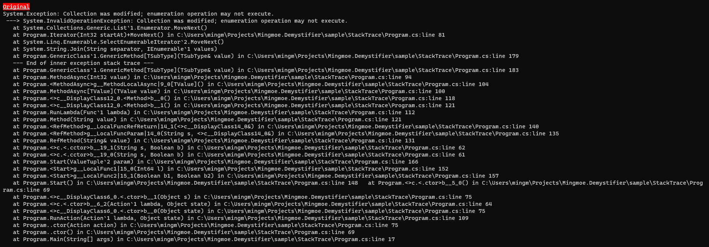
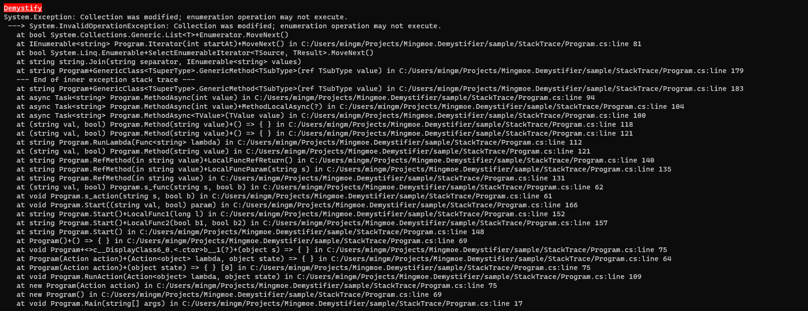
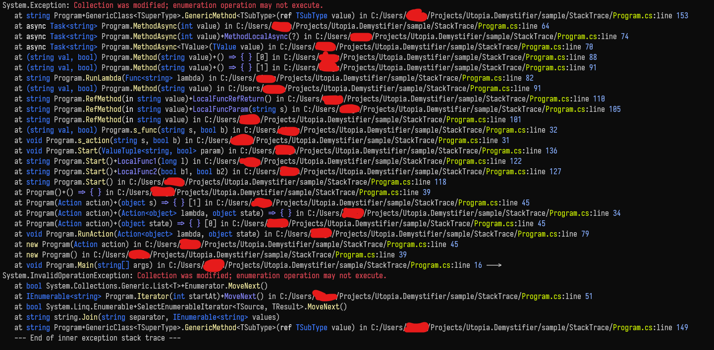

# Mingmoe.Demystifier
[](https://www.nuget.org/packages/Ben.Demystifier/)
[](https://github.com/benaadams/Ben.Demystifier/actions)

Print your exceptions **gracefully**!

FEATURE: 
 - Use [ZString](https://github.com/Cysharp/ZString)
 - Detailed frame stack information.
 - Colored(and you can customize it) string.

Like:


[](./image/original.png)
[](./image/demystify.png)
[](./image/image.png)


## Download

From [nuget](https://www.nuget.org/packages/Mingmoe.Demystifier)

### Usage

```C#
// print to console(stdout)
exception.PrintColoredStringDemystified();

// or print it by yourself!
string msg = exception.ToColoredStringDemystified();

// OR
// save colored amd demystified string to exception
// NOTE:this may cause something not be colored.
exception.ColoredDemystify();

// you can customize your own style!
using Mingmoe.Demystifier;

StyledBuilderOption option = new StyledBuilderOption();
option.shortenSourceFilePath = false;
option.SourcePathStyle.BackgroundColor = Color.Red;
option.ParamNameStyle.ForeColor = new Color(128, 128, 128);
option.ParamTypeStyle.isBold = true;

// apply it
ex.PrintColoredStringDemystified(option);
ex.ToColoredStringDemystified(option);
ex.ColoredDemystify(option);

// or save it as an global and default option
// StyledBuilderOption.GlobalOption = option;
// ex.PrintColoredStringDemystified(); 
// ex.ToColoredStringDemystified()
// ex.ColoredDemystify();

```

Origin function from [Ben.Demystifier](https://github.com/benaadams/Ben.Demystifier) should works.

### Problems with current stack traces: 

* **constructors** 

   Does not match code, output as `.ctor` and `.cctor`
   
* **parameters** 

   Do not specify qualifier `ref`, `out` or `in`
   
* **iterators** 

   Cannot determine overload `<Iterator>d__3.MoveNext()` rather than `Iterator(int startAt)+MoveNext()`
* **Linq**

   Cannot determine overload 
   
   `Linq.Enumerable.SelectEnumerableIterator``2.MoveNext()` 
   
   rather than
   
   `Linq.Enumerable+SelectEnumerableIterator<TSource, TResult>.MoveNext()`
* **async**

   Cannot determine overload and no modifier such as `async` 
   
   `<MethodAsync>d__5``1.MoveNext()` 
   
   rather than
   
   `async Task<string> Program.MethodAsync(int value)`

   Noise!
   ```
   --- End of stack trace from previous location where exception was thrown ---
   at System.Runtime.ExceptionServices.ExceptionDispatchInfo.Throw() 
   at System.Runtime.CompilerServices.TaskAwaiter.ThrowForNonSuccess(Task task)
   at System.Runtime.CompilerServices.TaskAwaiter.HandleNonSuccessAndDebuggerNotification(Task task) 
   at System.Runtime.CompilerServices.TaskAwaiter.ValidateEnd(Task task) 
   at System.Runtime.CompilerServices.TaskAwaiter.GetResult() 
   ```

* **lambdas**

   Mostly jibberish `<>c__DisplayClass2_0.<.ctor>b__0(Object state)` with a suggestion of where they are declared but no hint if there are multiple overloads of the method.
* **local functions**

   Mostly jibberish `<RefMethod>g__LocalFuncParam|10_0(String val, <>c__DisplayClass10_0& )` with a suggestion of where they are declared but no hint if there are multiple overloads of the method.
   
* **generic parameters**

   Not resolved, only an indication of the number `RunLambda(Func``1 lambda)` rather than `RunLambda(Func<string> lambda)`
* **value tuples**

   Do not match code, output as `ValueTuple``2 param` rather than `(string val, bool) param`
* **primitive types**

   Do not match code, output as `Int64`, `Boolean`, `String` rather than `long`, `bool`, `string`
* **return types**

   Skipped entirely from method signature

